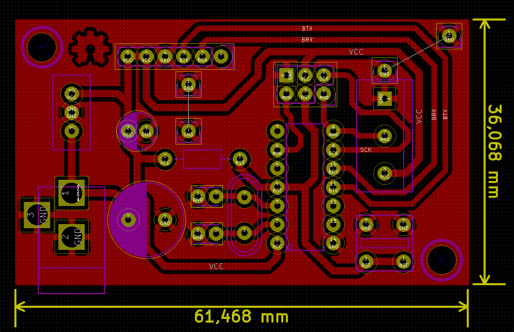

# rgb-strip-controller

Rgb strip controller for WS2812 led stripes like Adafruit Neopixel.

Please check out <a href="#updates">updates</a> below.

# Hardware

It uses an Attiny 84 to run the code and a HC-06 bluetooth module to communicate with Bluetooth with an [app](https://github.com/LuisDiazUgena/Hack-A-Lamp/).

The board it's designed to be milled with [Cyclone](https://store.bq.com/es/cyclone), an open source CNC(Project [here](https://github.com/carlosgs/Cyclone-PCB-Factory)).

# Software

I've created a sketch that uses [Neopixel library by Adafruit](https://github.com/adafruit/Adafruit_NeoPixel) to control Neopixel strip.

## Usage

Download the project and move .proto file to your smartphone (**recommended**) or tablet.

You can also open Protocoder file on your computer and copy it into an empty project on Protocoder web IDE.

**If your Arduino or Arduino cloned board doesn't have a Bluetooth module, you should connect a BT module and handle to receive data over BT-Serial.**

Upload *hack-a-lamp_arduino.ino* file to your Arduino board.

Install protocoder apk on your device and then, with a file explorer, open *projects_Hack-a-lamp.proto* file with protocoder. Then run it on your device.

You **must** first pair your BT board or module to your device with bluetooth settings.

On protocoder interface click on Connect to Bluetooth and choose your board, wait until both BTs are connected and move the sliders, then click on Send to change the color.

**Auto send feature**: Use this is you want Protocoder send data color as you modify it. Using this feature provides a almost real time experience.

**On/Off switch**: When it's turned on, the color is set to white. When it's turned off, the color is set to black.

###<a name="updates">Updates</a>

**28-12-2015**

1. Finished sketch and tested on breadboard
2. Finished PCB layout
3. Created Gerbers
4. Created Gcodes
